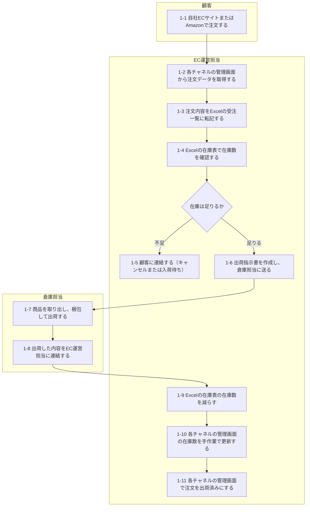
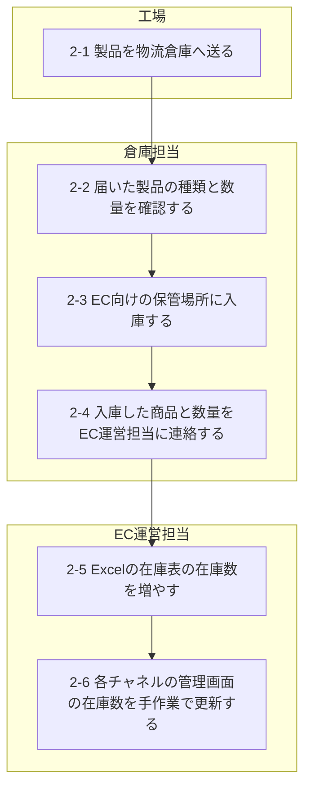

# LotLink 要件定義書 02 業務要件

## 改訂履歴

| 版 | 日付 | 内容 | 作成者 |
|---|---|---|---|
| 0.1 | 2026-10-05 | 初稿作成（要件定義 ステップ2：現行業務と課題） | （記入） |

## 1. 本書について

本書は、LotLink 受注・在庫管理システム（以下「本システム」）の業務要件を記載する。

本版では、現行業務（As-Is）と課題を記載する。導入後の業務（To-Be）と業務機能構成表は、ステップ3で追記する。

本書に記載する業務の内容は、ポートフォリオ作成のために設定した架空のものである。

## 2. 現行業務（As-Is）

対象は、自社ECサイトとAmazonで販売するEC向けの業務である。卸売の業務は対象外とする（`01_概要.md` の 6.2 を参照）。

### 2.1 登場する担当者とシステム

| 区分 | 名称 | 役割 |
|---|---|---|
| 担当者 | 顧客 | 自社ECサイトまたはAmazonで商品を注文する一般の消費者 |
| 担当者 | EC運営担当 | 注文の確認、在庫数の管理、出荷の指示を行う |
| 担当者 | 倉庫担当 | 物流倉庫で入庫、商品の取り出し、梱包、出荷を行う |
| 担当者 | 工場 | 製品を生産し、物流倉庫へ送る |
| システム | 自社ECサイト（現行） | 外部のカートサービスを利用して運営している。注文と在庫数は、このサービスの管理画面で扱う |
| システム | Amazon | 注文と在庫数は、Amazonの管理画面で扱う |
| システム | Excel | 受注一覧と在庫表を管理している |

### 2.2 業務フロー：受注から出荷まで

### 2.3 業務フロー：入庫

## 3. 課題一覧

| No. | 課題 | 発生する処理 | 影響 |
|---|---|---|---|
| 1 | 出荷後の在庫数の更新が手作業のため、各チャネルへの反映が遅れる | 1-9、1-10 | 実際の在庫数を超えて注文を受ける（売り越し） |
| 2 | 注文を受けた時点で在庫を確保していない | 1-4 〜 1-6 | 在庫を確認してから出荷するまでの間に、別の注文が同じ在庫を当てにしてしまう |
| 3 | 注文データをExcelへ手作業で転記している | 1-2、1-3 | 作業に時間がかかり、入力の誤りや漏れが起きる |
| 4 | ロットと使用期限を記録していない | 1-7、2-3 | どのロットをどの注文に出荷したかを追跡できない。使用期限の近いものから出荷できているかを確認できない |
| 5 | 入庫の反映が担当者間の連絡に依存している | 2-4 〜 2-6 | 在庫があるのに販売できない期間が生じる |
| 6 | 過去の受注と出荷の記録がExcelファイルに分かれて保存されている | 1-3、1-9 | 過去の記録を探すのに時間がかかる。集計にも手間がかかる |

`01_概要.md` の「3. 背景」に記載した問題との対応は次のとおり。

| 背景の問題 | 対応する課題 |
|---|---|
| 1 売り越し | 1、2 |
| 2 手作業による手間と誤り | 3、5、6 |
| 3 ロットを追跡できない | 4 |
| 4 現行の販売管理システムでECの受注を扱えない | 3 |

## 4. 未決事項

| ID | 内容 | 推奨案 |
|---|---|---|
| Q-008 | 現行の自社ECサイト（外部のカートサービス）の扱い | 本システムの自社EC画面（商品一覧、カート、注文）で置き換える。現行サイトは廃止する |
